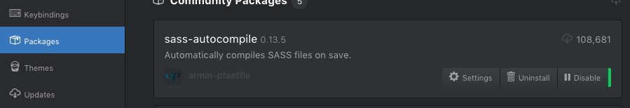
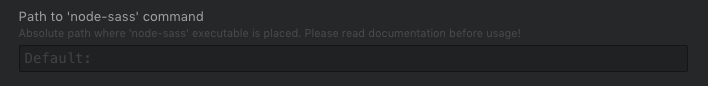
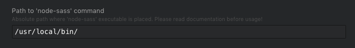

# SASS/SCSS
'macOS' 'sass' 'npm'

when you choose atom to write your code, sass-autocompile will be a good choice to compile your sass/scss file to css. But you need you install npm first and everything will be easier after that.
So let's start setting it.

### Step 0- install npm  
npm( Node Package Manager)
if you're already install homebrew, you can just use it to install npm
open a terminal and type:
```
$ brew install node
```
and it will help you to install npm and node

check the version that you install by
```
$ npm -v
$ node -v
```

### Step 1- npm init  
this part is important. before you install sass, you need a jason file for your machine.
So go to a folder where you would place all your project or any where.
and type:
```
$ npm init
or
$ npm init -y
```
the different between this 2 is -y can skip everything they want you to put on, and give the default vault.  

### Step 2- install node-sass  
just type:
```
$ npm install -g node-sass
```
then sit and wait  
check install with:
```
$ which node-sass
/usr/local/bin/node-sass
```

### Step 2- setup path with sass-autocompile in Atom  

open atom and go to Settings>Packages>sass-autocompile>setting
  

scroll down and find the block called 'Path to 'node-sass' command' and paste the location where your node-sass is.
  
  

now you can try open a new scss file and it will auto compile a css file after you save it.
