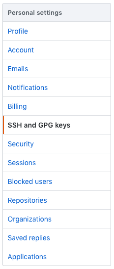
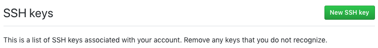
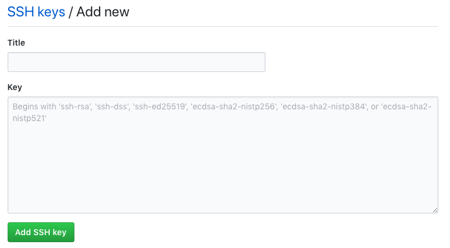
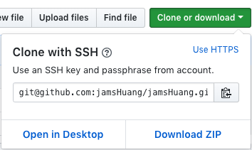

## git from nothing to connecting github with macOS
`#atom` `#git` `#github` `#macOS`

### Step 0- INSTALL HOMEBREW
open a terminal and paste this
```
$ /usr/bin/ruby -e "$(curl -fsSL https://raw.githubusercontent.com/Homebrew/install/master/install)"
```
it will ask you to keyDown RETURN to continue installing, but you might be stop by asking for Command line tools
by showing up the msg like
```
xcode-select: note: install requested for command line developer tools
Press any key when the installation has completed.
```
in macOS Mojave Version 10.14, might be meeting the problem with cannot find xcode-select
```
xcode-select: error: invalid developer directory '/Library/Developer/CommandLineTools'
Failed during: /usr/bin/sudo /usr/bin/xcode-select --switch /Library/Developer/CommandLineTools
```
unfortunately, we need to install command line tools by ourself   
find the file here https://developer.apple.com/download/more/  
and install the command line tools after that hit any key to finish installing  

[homebrew](https://brew.sh/index_zh-tw)

### Step 1- INSTALL or Upgrade Git
open terminal and upgrade or install git
```
**upgrade**
$ brew upgrade git   

**install**
$ brew install git
```    
check git version
```
$ git version
```
check git is in the right folder
```
$ which git
```
if it didn't show as '/usr/local/bin/git'
you need to link the git to homebrew's version by typing in terminal
```
$ brew link git
```

### Step 2- Set ssh key
open terminal and key down:
```
$ ssh-keygen -t rsa -C "account@example.com"
```
it will show
```
Generating public/private rsa key pair.
Enter file in which to save the key (/Users/account/.ssh/id_rsa): [press return]
Created directory '/Users/account/.ssh'.
Enter passphrase (empty for no passphrase): [press return or a password for ssh]
Enter same passphrase again: [return or password again]
Your identification has been saved in /Users/account/.ssh/id_rsa.
Your public key has been saved in /Users/account/.ssh/id_rsa.pub.
The key fingerprint is:
SHA....
```
and show your ssh key with enter
```
cat ~/.ssh/id_rsa.pub
```
now copy your ssh key and open github on browser   

go to setting in your github account  


choice SSH and GPG keys  


add new SSH key  


give a ssh title and paste the key you just copied  


go back to terminal check is it connect
```
$ ssh -T git@github.com
```

### Step 3- Git your repository
create a new repository that you wanna git with and copy  


in terminal go to the folder where you're going to place your repository
and type
```
git clone git@github.com:yourGithubID/repository.git(this is what you just copied)
```
now you can git to your github lol
```
to push your file
$ git add -A
$ git commit -m "msg"
$ git push
to pull your file
$ git fetch
$ git marge
$ git pull
```
it's really taking me a lot time for setting up. writing this note to make sure we can save lots of time next time.
